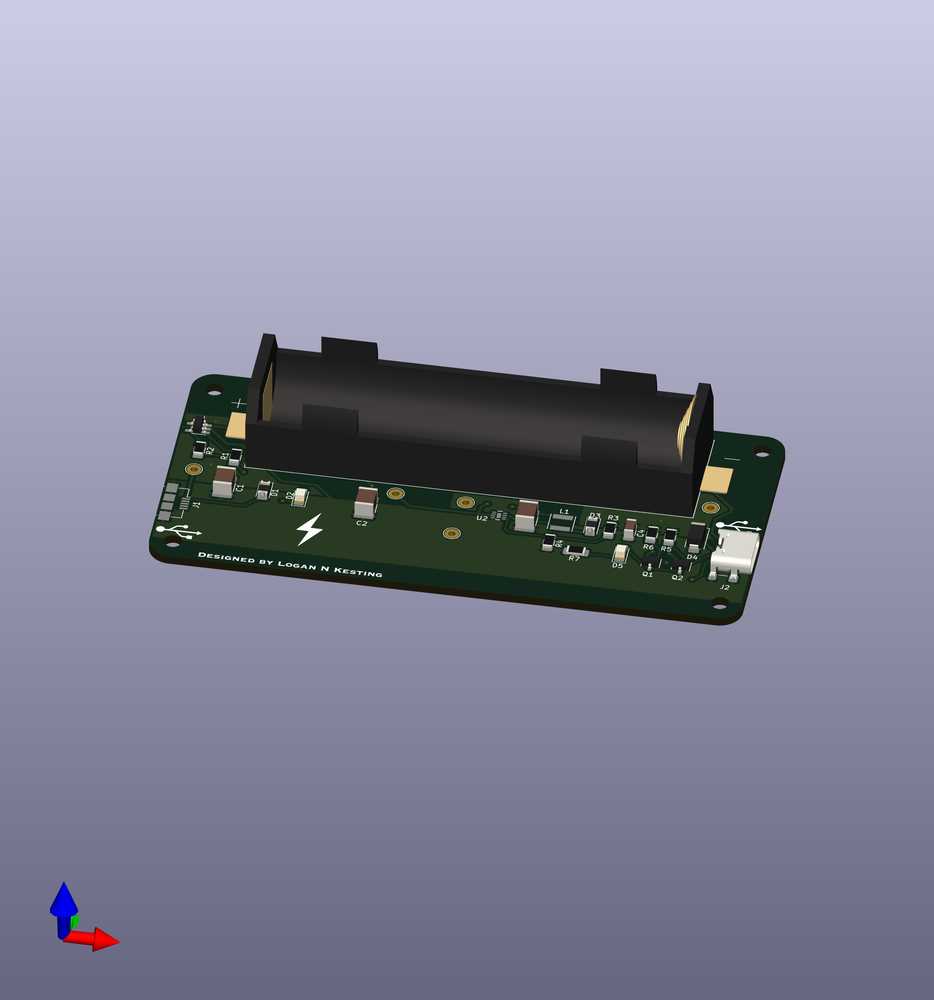

# Lithium-Ion Battery Charger 

## Overview
This is a portable, self-iniated power electronics project for a custom PCB in KiCad. The module charges a low-voltage (3.7V nominal) lithium-ion battery from a DC/DC voltage regulator and discharges to an 
external device via a USB-C connector. The voltage regulator charging the Lithium-Ion battery regulates a 5V DC input (via Micro USB-B) to the maximum voltage of the battery (4.2V). As the battery is used 
to charge an external device, the voltage decreases until it reaches 3V, where it dies and can no longer supply the external device. When the battery is being used to charge an external device, the voltage 
is increased back to 5V via an output regulated boost converter. The output voltage is determined by two feedback resistors that make up a voltage divider, where the voltage across the lower resistor 
(called the feedback voltage) is fed to a comparator within the IC. The feedback voltage is internally set to 1.24 V, allowing the output voltage to be set by the following equation:

The USB-C connector in the system has a 6-pin (power only) configuration and uses two pull-up 56k resistors to charge the external device at default power (5V @ 500mA). 

Brief description of your project, its purpose, and goals. Explain the key components like the system-level block diagram, KiCad design, and what makes your design unique or innovative.

## System-Level Block Diagram

## PCB Design
### KiCad Schematic
- The KiCad schematic shows the electrical connections of the circuit.
  - 

### 3D PCB View
- Below is a rendered 3D view of the PCB layout:
  - 

## File Structure
- `/Diagrams`: Contains block diagrams and system-level designs.
- `/KiCad`: KiCad project files, including schematics and PCB layouts.
- `/Images`: 3D screenshots, renderings, and other visuals.

## How to Use
1. Open the KiCad files from the `/KiCad` folder to review the schematic and PCB layout.
2. For the system design, check out the block diagram in `/Diagrams`.

## License
Optional: If your work is open-source, include a license here (MIT, GPL, etc.).
