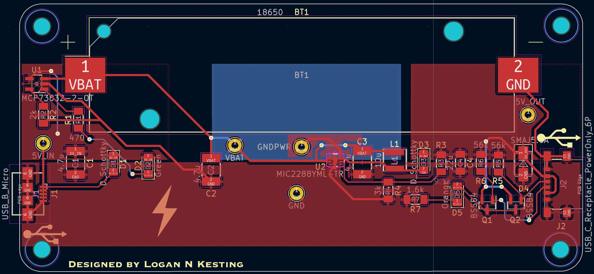

# Lithium-Ion Battery Charger
  Rendered 3D view of the PCB Layout:
  

  Video of the Fabricated PCB Charging a Device:
  

## Overview
This is a portable, self-iniated power electronics project for a custom PCB in KiCad. The module charges a low-voltage (3.7V nominal) lithium-ion battery from a DC/DC voltage regulator and discharges to an 
external device via a USB-C connector.

## System-Level Block Diagram

The voltage regulator charging the Lithium-Ion battery regulates a 5V DC input (via Micro USB-B) to the maximum voltage of the battery (4.2V). As the battery is used 
to charge an external device, the voltage decreases until it reaches 3V, where it dies and can no longer supply the external device. When the battery is being used to charge an external device, the voltage 
is increased back to 5V via an output regulated boost converter. The output voltage is determined by two feedback resistors that make up a voltage divider, where the voltage across the lower resistor 
(called the feedback voltage) is fed to a comparator within the IC. The feedback voltage is internally set to 1.24 V, allowing the output voltage to be set by the following equation:

Vout = Vref * (Rtop / Rbot + 1)

Where:
Vref = 1.24V
Rbot ≤ 5kΩ

In this application, Rtop = 9.1kΩ and Rbot = 3kΩ making the regulated output voltage of the boost converter Vout ≈ 5V.

The USB-C connector in the system has a 6-pin (power only) configuration and uses two pull-up 56kΩ resistors on the CC pins to charge the external device at default power (5V @ 500mA). The CC pin voltage is also used to drive PMOS MOSFET gates. When the external device is not connected, the CC pin voltages are pulled up to 5V, preventing the PMOS from conducting to illuminate the LED. When an external device is connected
the PMOS gate voltage is significacntly less than at the source of the PMOS, turning on the MOSFET and thus illuminating the LED. See the system schematic and PCB below for further reference.

## PCB Design
### KiCad Schematic
- The KiCad schematic shows the electrical connections of the circuit.
  - 

### KiCad PCB
- The KiCad PCB shows the physical connections and overall routing of traces in the circuit.
  - 

### Bill of Materials (BOM)
-  Below is the Bill of Materials, or the needed parts for the project:
  - 

## File Structure
- `/BOM`: Contains Bill of Materials for the project.
- `/Diagrams`: Contains system-level block diagram of the project.
- `/KiCad Project`: KiCad project file, including schematics and PCB layouts.
- `/PCB`: Contains KiCad PCB file, screenshot of the KiCad PCB design, video of the fabricated PCB charging a device, and the 3D view of the PCB.
- `/Schematic`: Contains KiCad schematic file and a screenshot of the KiCad Schematic design.

## How to Use
1. Open the KiCad files from the `/PCB` and `/Schematic` folders to review the PCB layout and schematic.
2. Open the KiCad project from the `/KiCad Project` folder to download the whole project including the PCB and schematic.
3. For the system design, check out the block diagram in `/Diagrams`.
4. For the Bill of Materials, navigate to the `/BOM` folder to see the specific components used in the project

## License

This hardware design is licensed under the **CERN Open Hardware License v2 - Strongly Reciprocal (CERN-OHL-S)**. You are free to use, modify, and share this project, as long as you distribute any derived works under the same license.

For more details, see the [LICENSE](./LICENSE) file.
